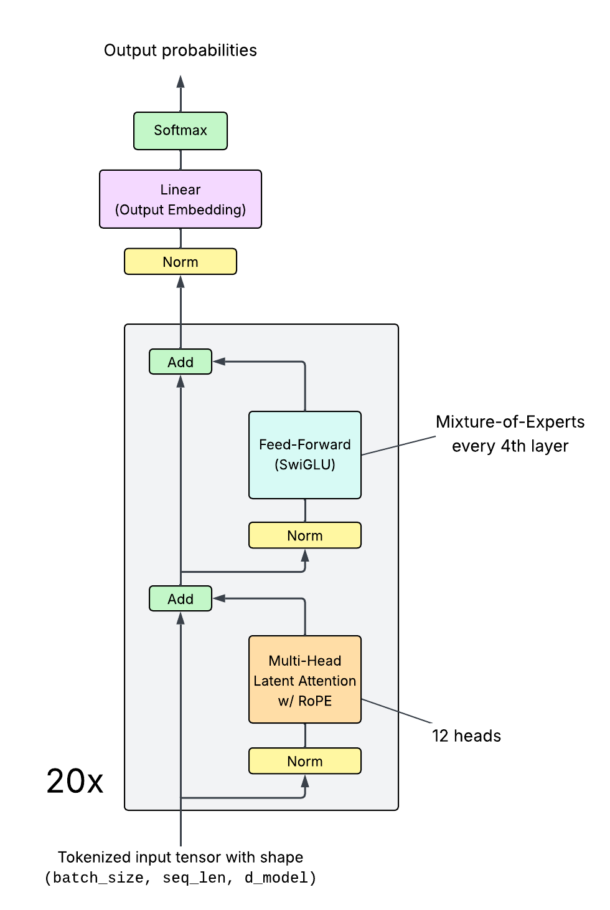
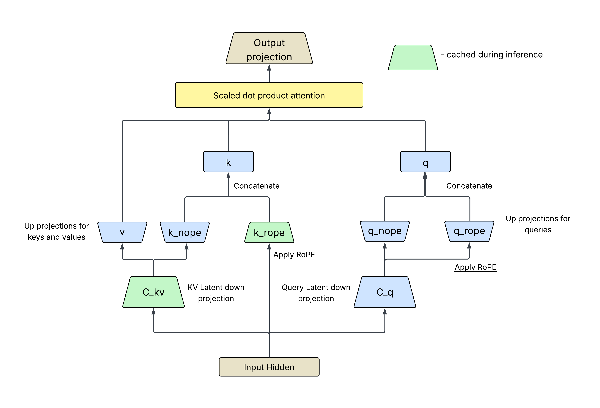
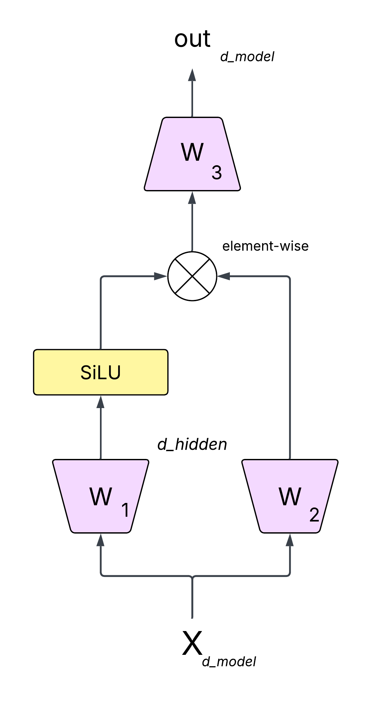
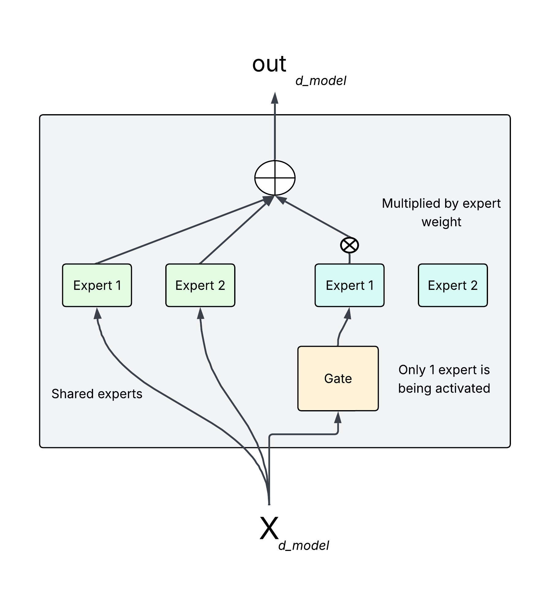

# nano-llm
NanoLLM is a small neural language model with 327M parameters, this repository includes source code for model implementation, training, data processing and Group Relative Policy Optimization post-training.

## Table of Contents
- [nano-llm](#nano-llm)
  - [Table of Contents](#table-of-contents)
  - [Architecture](#architecture)
    - [Multi-Head Latent Attention](#multi-head-latent-attention)
    - [SwiGLU](#swiglu)
    - [Mixture of Experts](#mixture-of-experts)
  - [Training](#training)
  - [Post-Training](#post-training)
  - [Run code yourself](#run-code-yourself)
  - [Usage](#usage)
  - [License](#license)

## Architecture
The archite of NanoLLM was mainly inspired by [Llama4](https://ai.meta.com/blog/llama-4-multimodal-intelligence/) and  [DeepSeekV3](https://arxiv.org/abs/2412.19437).
Configurations of the model can be found in config folder. Here is an overview of an architecture:



### Multi-Head Latent Attention 
The Multi-Head Layer Attention (MLA) layer, adopted from DeepSeekV3, is a variation of traditional multi-head attention. Instead of attending over all tokens directly, MLA introduces a set of latent vectors, that the attention mechanism uses to summarize and propagate contextual information. This allows reducing memory footprint, faster attention computation and efficient global context modeling for long sequences.



### SwiGLU
[SwiGLU](https://arxiv.org/pdf/2002.05202v1) is used as the feed-forward layer in most blocks, it is an improvement over standard feed-forward layers. Its main advantage is that it provides a smoother transition around 0, which leads to better optimization and faster convergence.



### Mixture of Experts 
Every nth block in NanoLLM replaces the standard feed-forward layer with a Mixture of Experts (MoE) layer.
MoE consists of multiple expert feed-forward networks, where a gating mechanism dynamically selects which experts to use for each token. This is the simples MoE architecture:



## Training 
Training details will be added later...

## Post-Training
TODO
Group Relative Policy Optimization works by maximizing this objective:

$J_{\mathrm{GRPO}}(\theta) = \mathbb{E}_{q\sim P(Q),\ \{o_i\}_{i=1}^G\sim\pi_{\theta_{\mathrm{old}}}(O|q)}\Big[ \frac{1}{G}\sum_{i=1}^G \Big( \min\!\Big( \frac{\pi_\theta(o_i|q)}{\pi_{\theta_{\mathrm{old}}}(o_i|q)}\,A_i,\ \operatorname{clip}\!\big(\tfrac{\pi_\theta(o_i|q)}{\pi_{\theta_{\mathrm{old}}}(o_i|q)},\,1-\epsilon,\,1+\epsilon\big)\,A_i \Big) - \beta\,D_{\mathrm{KL}}(\pi_\theta\|\pi_{\mathrm{ref}}) \Big) \Big]$

where KL divergence is:
$D_{\mathrm{KL}}(\pi_\theta\|\pi_{\mathrm{ref}}) = \frac{\pi_{\mathrm{ref}}(o_i|q)}{\pi_\theta(o_i|q)} - \log\!\frac{\pi_{\mathrm{ref}}(o_i|q)}{\pi_\theta(o_i|q)} - 1$

and advantage:
$A_i = \dfrac{r_i - \operatorname{mean}\{r_1,\dots,r_G\}}{\operatorname{std}\{r_1,\dots,r_G\}}$

## Run code yourself
1. Clone the repository:
```bash
git clone https://github.com/asoloveii/nano-llm.git
```

2. Install dependencies:
```bash
pip install -r requirements.txt
 ```

3. Will be soon...

## Usage
huggingface will be soon...

## License
This project is licensed under the [MIT License](LICENSE).
