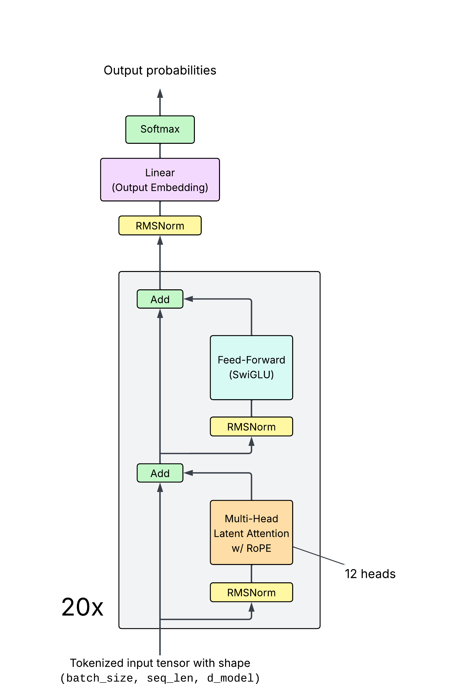
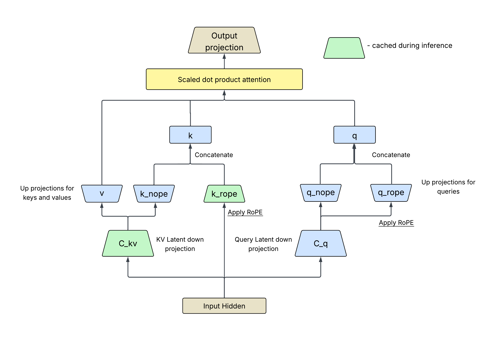
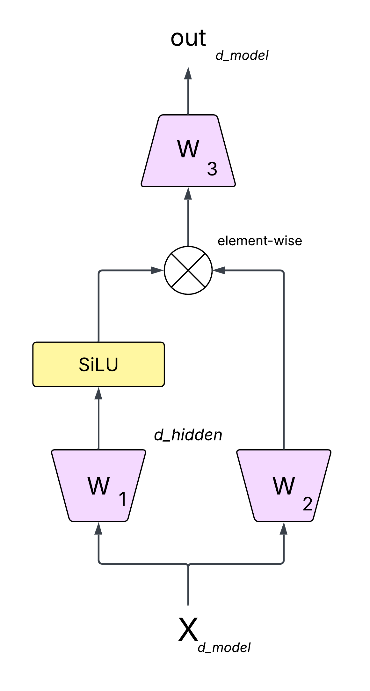

# nano-llm
NanoLM is a small neural language model with 268M parameters, this repository includes source code for model implementation, training, data processing and Group Relative Policy Optimization post-training.

## Table of Contents
- [nano-llm](#nano-llm)
  - [Table of Contents](#table-of-contents)
  - [Architecture](#architecture)
    - [Multi-Head Latent Attention](#multi-head-latent-attention)
    - [SwiGLU](#swiglu)
  - [Training and Post-Training](#training-and-post-training)
  - [Code Structure](#code-structure)
  - [License](#license)

## Architecture
The archite of NanoLM was mainly inspired by [Llama4](https://ai.meta.com/blog/llama-4-multimodal-intelligence/) and  [DeepSeekV3](https://arxiv.org/abs/2412.19437).
Configurations of the model can be found in config folder. Here is an overview of an architecture:

### Multi-Head Latent Attention 
The Multi-Head Layer Attention (MLA) layer, adopted from DeepSeekV3, is a variation of traditional multi-head attention. Instead of attending over all tokens directly, MLA introduces a set of latent vectors, that the attention mechanism uses to summarize and propagate contextual information. This allows reducing memory footprint, faster attention computation and efficient global context modeling for long sequences.

### SwiGLU
[SwiGLU](https://arxiv.org/pdf/2002.05202v1) is used as the feed-forward layer in most blocks, it is an improvement over standard feed-forward layers. Its main advantage is that it provides a smoother transition around 0, which leads to better optimization and faster convergence.

## Training and Post-Training
Training details will be added later...

## Code Structure

## License
This project is licensed under the [MIT License](LICENSE).
