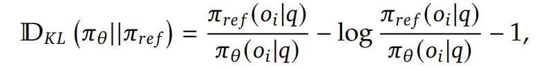

# nano-llm
NanoLLM is a small neural language model with 327M parameters, this repository includes source code for model implementation, training, data processing and Group Relative Policy Optimization post-training.

## Table of Contents
- [nano-llm](#nano-llm)
  - [Table of Contents](#table-of-contents)
  - [Architecture](#architecture)
    - [Multi-Head Latent Attention](#multi-head-latent-attention)
    - [SwiGLU](#swiglu)
    - [Mixture of Experts](#mixture-of-experts)
  - [Training](#training)
  - [Post-Training](#post-training)
  - [Run code yourself from scratch](#run-code-yourself-from-scratch)
    - [1. Installation](#1-installation)
      - [1. Clone the repository:](#1-clone-the-repository)
      - [2. Activate environment](#2-activate-environment)
      - [3. Install dependencies:](#3-install-dependencies)
    - [2. Data processing](#2-data-processing)
      - [1. Train a SentencePiece Tokenizer](#1-train-a-sentencepiece-tokenizer)
      - [2. Preprocess and tokenize data](#2-preprocess-and-tokenize-data)
  - [License](#license)

## Architecture
The archite of NanoLLM was mainly inspired by [Llama4](https://ai.meta.com/blog/llama-4-multimodal-intelligence/) and  [DeepSeekV3](https://arxiv.org/abs/2412.19437).
Configurations of the model can be found in config folder. Here is an overview of an architecture:


### Multi-Head Latent Attention 
The Multi-Head Layer Attention (MLA) layer, adopted from DeepSeekV3, is a variation of traditional multi-head attention. Instead of attending over all tokens directly, MLA introduces a set of latent vectors, that the attention mechanism uses to summarize and propagate contextual information. This allows reducing memory footprint, faster attention computation and efficient global context modeling for long sequences.


### SwiGLU
[SwiGLU](https://arxiv.org/pdf/2002.05202v1) is used as the feed-forward layer in most blocks, it is an improvement over standard feed-forward layers. Its main advantage is that it provides a smoother transition around 0, which leads to better optimization and faster convergence.


### Mixture of Experts 
Every nth block in NanoLLM replaces the standard feed-forward layer with a Mixture of Experts (MoE) layer.
MoE consists of multiple expert feed-forward networks, where a gating mechanism dynamically selects which experts to use for each token. This is the simples MoE architecture:


## Training 
Training details will be added later...

## Post-Training
TODO
Group Relative Policy Optimization works by maximizing this objective:


where KL divergence is:



and advantage is:


## Run code yourself from scratch

### 1. Installation

#### 1. Clone the repository:
```bash
git clone https://github.com/asoloveii/nano-llm.git
cd nano-llm
```

#### 2. Activate environment

Linux/MacOS
```bash
python3 -m venv .venv
source .venv/bin/activate
```

Windows
```bash
python -m venv .venv
.venv\Scripts\activate
```

#### 3. Install dependencies:
```bash
pip install --upgrade pip
pip install -r requirements.txt
```

### 2. Data processing

#### 1. Train a SentencePiece Tokenizer

```bash
python -m src.tokenizer \
  --dataset_name Elriggs/openwebtext-100k \
  --output_dir ./checkpoints/tokenizer \
  --model_type bpe \
  --model_name bpe_tokenizer \
  --vocab_size 50304 \
```

For additional information about tokenizer, run the following command:
```bash
python -m src/tokenizer --help
```

#### 2. Preprocess and tokenize data

The following script tokenizes and prepares datasets (OpenWebText, SuperNatural Instructions and GSM8K)
for pretraining or post-training by storing them as memory-mapped NumPy arrays (`.npy` files).

Here's an example for a sample from OpenWebText dataset:
```bash
python -m src.preprocess owt \
  --tokenizer_path ./checkpoints/tokenizer/bpe_tokenizer.model \
  --save_dir ./data/openwebtext \
  --max_tokens_train 2180000000 \
  --max_tokens_val 100000 \
  --flush_every 50000
```


## License
This project is licensed under the [MIT License](LICENSE).
